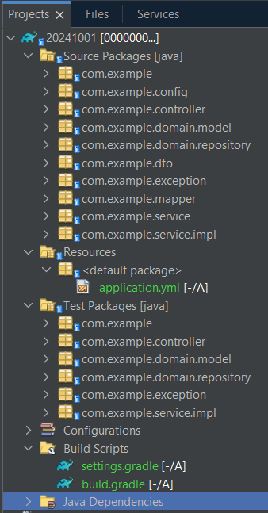

#MICROSERVICIO SPRING BOOT#

Este documento describe la estructura y configuración de un microservicio desarrollado con Spring Boot, utilizando Java 17 y Gradle como herramienta de construcción. También se incluyen detalles sobre los frameworks y herramientas utilizadas, así como diagramas para ilustrar la solución.

## Estructura del Proyecto ##

### Descripción de Directorios ###
***controller***: Contiene los controladores REST que manejan las solicitudes HTTP.

***dto***: Define los objetos de transferencia de datos (DTO) que se utilizan para interactuar con el cliente.

***exception***: Incluye las clases para manejar excepciones personalizadas.

***mapper***: Contiene las clases que transforman entidades en DTOs y viceversa.

***model***: Define las entidades JPA que representan las tablas de la base de datos.

***repository***: Contiene las interfaces de repositorio que extienden JpaRepository.

***service***: Implementa la lógica de negocio y utiliza los repositorios para acceder a los datos.

## Herramientas y Frameworks Utilizados ##
***Java 17***: Lenguaje de programación utilizado para desarrollar la aplicación. Java 17 es una versión LTS (Long Term Support) que ofrece mejoras en rendimiento y seguridad.

***Spring Boot***: Framework que simplifica la creación de aplicaciones Java al ofrecer configuraciones predeterminadas para proyectos Spring.

***Gradle***: Herramienta de automatización de construcción utilizada para gestionar dependencias y construir el proyecto.

***Lombok***: Biblioteca que reduce el código boilerplate mediante anotaciones como @Data, @Builder, etc.

***Spring Data JPA***: Proporciona una capa de abstracción sobre JPA, facilitando el acceso a datos.

***Mockito***: Framework para pruebas unitarias que permite crear mocks para simular el comportamiento de objetos complejos.

## DIAGRAMAS ##

### CLASES ###

## EJECUCIÓN Y PROEBAS ##

### Ejecución ###

1. En una ventana de comandos de Windows o Linux
   Se deben ver los siguiente archivos/directorios:

   

2. Ejecutar el siguiente comando en la raíz del proyecto: ***gradle clean build test***
3. Ejecutar en la misma raíz del proyecto el comando: ***gradle bootRun***
4. Para deter la ejecución presionar las teclas CONTROL + C

### Pruebas ###
Para ejecutar pruebas de los endpoints se puede acceder a la UI de Swagger en la siguiente URL: http://localhost:8080/swagger-ui/index.html

